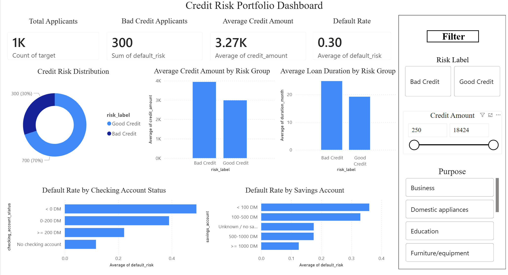

# Credit Risk Analytics Dashboard and Classification Project

## Project Overview

This project analyzes credit risk patterns using the German Credit dataset. The goal is to identify key factors associated with bad credit risk, build baseline classification models, and create a Power BI dashboard for portfolio-level risk monitoring.

The project demonstrates an end-to-end analytics workflow using Python for data cleaning, exploratory data analysis, machine learning, and business cost evaluation, along with Power BI for dashboard reporting.

## Tools Used

- Python
- pandas
- matplotlib
- seaborn
- scikit-learn
- Power BI

## Dataset

The dataset contains 1,000 credit applicants with 20 original financial and demographic features. The original target variable classifies applicants as good credit or bad credit. For modeling purposes, the target was converted into a binary default risk variable:

- 0 = Good Credit
- 1 = Bad Credit

## Project Workflow

1. Loaded and cleaned the German Credit dataset
2. Decoded categorical variables into readable labels
3. Conducted exploratory data analysis to identify credit risk patterns
4. Built an interactive Power BI dashboard for risk monitoring
5. Trained Logistic Regression and Random Forest models
6. Evaluated models using accuracy, precision, recall, F1 score, ROC-AUC, and business cost
7. Selected the preferred model based on credit risk business objectives

## Dashboard Preview

## Key Insights

- Bad credit applicants had higher average credit amounts and longer average loan durations than good credit applicants.
- Applicants with negative checking account balances showed the highest default rates, suggesting weak short-term liquidity is associated with higher credit risk.
- Applicants with higher savings balances generally showed lower default rates, indicating that stronger financial buffers may improve repayment capacity.
- Logistic Regression achieved higher recall for bad credit applicants and a lower business cost than Random Forest, making it the preferred model for this project.

## Model Results

| Model | Accuracy | Precision | Recall | F1 Score | ROC AUC | Business Cost |
|---|---:|---:|---:|---:|---:|---:|
| Logistic Regression | 0.750 | 0.558 | 0.800 | 0.658 | 0.806 | 98 |
| Random Forest | 0.755 | 0.575 | 0.700 | 0.632 | 0.800 | 121 |

## Business Interpretation

Although Random Forest achieved slightly higher accuracy, Logistic Regression was selected because it achieved higher recall for bad credit applicants and a lower business cost. In credit risk analysis, false negatives are more costly because they represent high-risk applicants incorrectly classified as low risk.

## Files

- `notebook/credit_risk_analysis.ipynb`: Python analysis and machine learning workflow
- `output/cleaned_german_credit_data.csv`: Cleaned dataset used for Power BI
- `output/model_predictions.csv`: Model prediction results
- `images/credit_risk_dashboard.png`: Power BI dashboard screenshot
- `powerbi/credit_risk_dashboard.pbix`: Interactive Power BI dashboard file, if available
